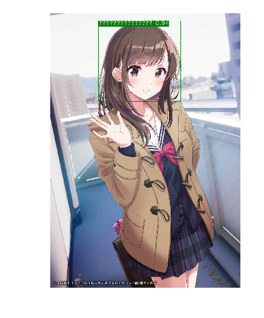
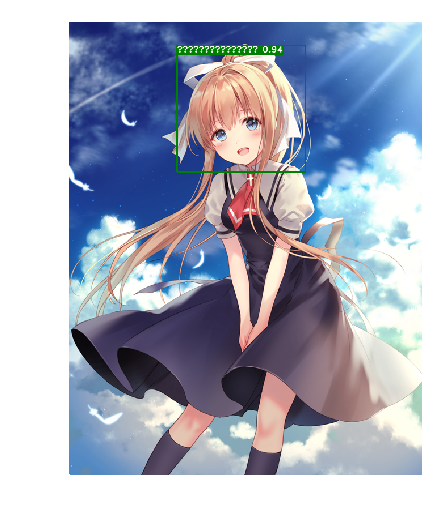

# 基于PPYOLOv2的二次元面部定位
基于PPYOLOv2的二次元面部定位，快速定位一张图中的二次元人物面部

##  一、项目背景
七夕节只有陪陪纸片人才能勉强维持得了生活这样子

## 二、数据集简介
自建数据集，图片从著名插画网pixiv爬取。  
用easydata创建数据集并智能标注，导出生成VOC格式数据集。  
用opencv处理图片，确保为三通道图。  
在本地用paddlex划分数据集，并按格式要求进行调整，比如文件夹名改成JPEGImages。  
最后导入aistudio平台。

### 1. 环境准备


```python
# 环境准备

# 安装PaddleX
! pip install paddlex==2.0.0rc4 -i https://mirror.baidu.com/pypi/simple
! pip install cython  
! pip install pycocotools
```

    Looking in indexes: https://mirror.baidu.com/pypi/simple
    Collecting paddlex==2.0.0rc4
    [?25l  Downloading https://mirror.baidu.com/pypi/packages/db/f0/7025496b2cbe60971def5f6560d74054d1b6a08c9042aa99d524676fe8ec/paddlex-2.0.0rc4-py3-none-any.whl (992kB)
         |████████████████████████████████| 993kB 13.4MB/s eta 0:00:01
    [?25hRequirement already satisfied: pyyaml in /opt/conda/envs/python35-paddle120-env/lib/python3.7/site-packages (from paddlex==2.0.0rc4) (5.1.2)
    Requirement already satisfied: tqdm in /opt/conda/envs/python35-paddle120-env/lib/python3.7/site-packages (from paddlex==2.0.0rc4) (4.36.1)
    Requirement already satisfied: scipy in /opt/conda/envs/python35-paddle120-env/lib/python3.7/site-packages (from paddlex==2.0.0rc4) (1.3.0)
    Collecting pycocotools; platform_system != "Windows" (from paddlex==2.0.0rc4)
      Downloading https://mirror.baidu.com/pypi/packages/de/df/056875d697c45182ed6d2ae21f62015896fdb841906fe48e7268e791c467/pycocotools-2.0.2.tar.gz
    Collecting scikit-learn==0.23.2 (from paddlex==2.0.0rc4)
    [?25l  Downloading https://mirror.baidu.com/pypi/packages/f4/cb/64623369f348e9bfb29ff898a57ac7c91ed4921f228e9726546614d63ccb/scikit_learn-0.23.2-cp37-cp37m-manylinux1_x86_64.whl (6.8MB)
         |████████████████████████████████| 6.8MB 13.9MB/s eta 0:00:01
    [?25hRequirement already satisfied: colorama in /opt/conda/envs/python35-paddle120-env/lib/python3.7/site-packages (from paddlex==2.0.0rc4) (0.4.4)
    Collecting lap (from paddlex==2.0.0rc4)
    [?25l  Downloading https://mirror.baidu.com/pypi/packages/bf/64/d9fb6a75b15e783952b2fec6970f033462e67db32dc43dfbb404c14e91c2/lap-0.4.0.tar.gz (1.5MB)
         |████████████████████████████████| 1.5MB 13.5MB/s eta 0:00:01
    [?25hRequirement already satisfied: visualdl>=2.1.1 in /opt/conda/envs/python35-paddle120-env/lib/python3.7/site-packages (from paddlex==2.0.0rc4) (2.2.0)
    Collecting shapely>=1.7.0 (from paddlex==2.0.0rc4)
    [?25l  Downloading https://mirror.baidu.com/pypi/packages/98/f8/db4d3426a1aba9d5dfcc83ed5a3e2935d2b1deb73d350642931791a61c37/Shapely-1.7.1-cp37-cp37m-manylinux1_x86_64.whl (1.0MB)
         |████████████████████████████████| 1.0MB 34.0MB/s eta 0:00:01
    [?25hRequirement already satisfied: opencv-python in /opt/conda/envs/python35-paddle120-env/lib/python3.7/site-packages (from paddlex==2.0.0rc4) (4.1.1.26)
    Collecting motmetrics (from paddlex==2.0.0rc4)
    [?25l  Downloading https://mirror.baidu.com/pypi/packages/9c/28/9c3bc8e2a87f4c9e7b04ab72856ec7f9895a66681a65973ffaf9562ef879/motmetrics-1.2.0-py3-none-any.whl (151kB)
         |████████████████████████████████| 153kB 28.5MB/s eta 0:00:01
    [?25hCollecting paddleslim==2.1.0 (from paddlex==2.0.0rc4)
    [?25l  Downloading https://mirror.baidu.com/pypi/packages/f8/c1/89cb84ff5cd9c562c086bc0abfb81f6b568e93da9b707d7eb8d701ca8779/paddleslim-2.1.0-py3-none-any.whl (300kB)
         |████████████████████████████████| 307kB 27.9MB/s eta 0:00:01
    [?25hRequirement already satisfied: numpy>=1.13.3 in /opt/conda/envs/python35-paddle120-env/lib/python3.7/site-packages (from scipy->paddlex==2.0.0rc4) (1.16.4)
    Requirement already satisfied: setuptools>=18.0 in /opt/conda/envs/python35-paddle120-env/lib/python3.7/site-packages (from pycocotools; platform_system != "Windows"->paddlex==2.0.0rc4) (41.4.0)
    Requirement already satisfied: cython>=0.27.3 in /opt/conda/envs/python35-paddle120-env/lib/python3.7/site-packages (from pycocotools; platform_system != "Windows"->paddlex==2.0.0rc4) (0.29)
    Requirement already satisfied: matplotlib>=2.1.0 in /opt/conda/envs/python35-paddle120-env/lib/python3.7/site-packages (from pycocotools; platform_system != "Windows"->paddlex==2.0.0rc4) (2.2.3)
    Requirement already satisfied: joblib>=0.11 in /opt/conda/envs/python35-paddle120-env/lib/python3.7/site-packages (from scikit-learn==0.23.2->paddlex==2.0.0rc4) (0.14.1)
    Collecting threadpoolctl>=2.0.0 (from scikit-learn==0.23.2->paddlex==2.0.0rc4)
      Downloading https://mirror.baidu.com/pypi/packages/c6/e8/c216b9b60cbba4642d3ca1bae7a53daa0c24426f662e0e3ce3dc7f6caeaa/threadpoolctl-2.2.0-py3-none-any.whl
    Requirement already satisfied: protobuf>=3.11.0 in /opt/conda/envs/python35-paddle120-env/lib/python3.7/site-packages (from visualdl>=2.1.1->paddlex==2.0.0rc4) (3.14.0)
    Requirement already satisfied: flake8>=3.7.9 in /opt/conda/envs/python35-paddle120-env/lib/python3.7/site-packages (from visualdl>=2.1.1->paddlex==2.0.0rc4) (3.8.2)
    Requirement already satisfied: bce-python-sdk in /opt/conda/envs/python35-paddle120-env/lib/python3.7/site-packages (from visualdl>=2.1.1->paddlex==2.0.0rc4) (0.8.53)
    Requirement already satisfied: six>=1.14.0 in /opt/conda/envs/python35-paddle120-env/lib/python3.7/site-packages (from visualdl>=2.1.1->paddlex==2.0.0rc4) (1.15.0)
    Requirement already satisfied: pre-commit in /opt/conda/envs/python35-paddle120-env/lib/python3.7/site-packages (from visualdl>=2.1.1->paddlex==2.0.0rc4) (1.21.0)
    Requirement already satisfied: Flask-Babel>=1.0.0 in /opt/conda/envs/python35-paddle120-env/lib/python3.7/site-packages (from visualdl>=2.1.1->paddlex==2.0.0rc4) (1.0.0)
    Requirement already satisfied: Pillow>=7.0.0 in /opt/conda/envs/python35-paddle120-env/lib/python3.7/site-packages (from visualdl>=2.1.1->paddlex==2.0.0rc4) (7.1.2)
    Requirement already satisfied: requests in /opt/conda/envs/python35-paddle120-env/lib/python3.7/site-packages (from visualdl>=2.1.1->paddlex==2.0.0rc4) (2.22.0)
    Requirement already satisfied: pandas in /opt/conda/envs/python35-paddle120-env/lib/python3.7/site-packages (from visualdl>=2.1.1->paddlex==2.0.0rc4) (1.1.5)
    Requirement already satisfied: flask>=1.1.1 in /opt/conda/envs/python35-paddle120-env/lib/python3.7/site-packages (from visualdl>=2.1.1->paddlex==2.0.0rc4) (1.1.1)
    Requirement already satisfied: shellcheck-py in /opt/conda/envs/python35-paddle120-env/lib/python3.7/site-packages (from visualdl>=2.1.1->paddlex==2.0.0rc4) (0.7.1.1)
    Collecting pytest-benchmark (from motmetrics->paddlex==2.0.0rc4)
    [?25l  Downloading https://mirror.baidu.com/pypi/packages/2c/60/423a63fb190a0483d049786a121bd3dfd7d93bb5ff1bb5b5cd13e5df99a7/pytest_benchmark-3.4.1-py2.py3-none-any.whl (50kB)
         |████████████████████████████████| 51kB 14.3MB/s eta 0:00:01
    [?25hCollecting xmltodict>=0.12.0 (from motmetrics->paddlex==2.0.0rc4)
      Downloading https://mirror.baidu.com/pypi/packages/28/fd/30d5c1d3ac29ce229f6bdc40bbc20b28f716e8b363140c26eff19122d8a5/xmltodict-0.12.0-py2.py3-none-any.whl
    Collecting pytest (from motmetrics->paddlex==2.0.0rc4)
    [?25l  Downloading https://mirror.baidu.com/pypi/packages/a1/59/6821e900592fbe261f19d67e4def0cb27e52ef8ed16d9922c144961cc1ee/pytest-6.2.4-py3-none-any.whl (280kB)
         |████████████████████████████████| 286kB 24.2MB/s eta 0:00:01
    [?25hCollecting flake8-import-order (from motmetrics->paddlex==2.0.0rc4)
      Downloading https://mirror.baidu.com/pypi/packages/ab/52/cf2d6e2c505644ca06de2f6f3546f1e4f2b7be34246c9e0757c6048868f9/flake8_import_order-0.18.1-py2.py3-none-any.whl
    Requirement already satisfied: pyzmq in /opt/conda/envs/python35-paddle120-env/lib/python3.7/site-packages (from paddleslim==2.1.0->paddlex==2.0.0rc4) (18.1.1)
    Requirement already satisfied: python-dateutil>=2.1 in /opt/conda/envs/python35-paddle120-env/lib/python3.7/site-packages (from matplotlib>=2.1.0->pycocotools; platform_system != "Windows"->paddlex==2.0.0rc4) (2.8.0)
    Requirement already satisfied: pytz in /opt/conda/envs/python35-paddle120-env/lib/python3.7/site-packages (from matplotlib>=2.1.0->pycocotools; platform_system != "Windows"->paddlex==2.0.0rc4) (2019.3)
    Requirement already satisfied: cycler>=0.10 in /opt/conda/envs/python35-paddle120-env/lib/python3.7/site-packages (from matplotlib>=2.1.0->pycocotools; platform_system != "Windows"->paddlex==2.0.0rc4) (0.10.0)
    Requirement already satisfied: kiwisolver>=1.0.1 in /opt/conda/envs/python35-paddle120-env/lib/python3.7/site-packages (from matplotlib>=2.1.0->pycocotools; platform_system != "Windows"->paddlex==2.0.0rc4) (1.1.0)
    Requirement already satisfied: pyparsing!=2.0.4,!=2.1.2,!=2.1.6,>=2.0.1 in /opt/conda/envs/python35-paddle120-env/lib/python3.7/site-packages (from matplotlib>=2.1.0->pycocotools; platform_system != "Windows"->paddlex==2.0.0rc4) (2.4.2)
    Requirement already satisfied: mccabe<0.7.0,>=0.6.0 in /opt/conda/envs/python35-paddle120-env/lib/python3.7/site-packages (from flake8>=3.7.9->visualdl>=2.1.1->paddlex==2.0.0rc4) (0.6.1)
    Requirement already satisfied: pycodestyle<2.7.0,>=2.6.0a1 in /opt/conda/envs/python35-paddle120-env/lib/python3.7/site-packages (from flake8>=3.7.9->visualdl>=2.1.1->paddlex==2.0.0rc4) (2.6.0)
    Requirement already satisfied: pyflakes<2.3.0,>=2.2.0 in /opt/conda/envs/python35-paddle120-env/lib/python3.7/site-packages (from flake8>=3.7.9->visualdl>=2.1.1->paddlex==2.0.0rc4) (2.2.0)
    Requirement already satisfied: importlib-metadata; python_version < "3.8" in /opt/conda/envs/python35-paddle120-env/lib/python3.7/site-packages (from flake8>=3.7.9->visualdl>=2.1.1->paddlex==2.0.0rc4) (0.23)
    Requirement already satisfied: future>=0.6.0 in /opt/conda/envs/python35-paddle120-env/lib/python3.7/site-packages (from bce-python-sdk->visualdl>=2.1.1->paddlex==2.0.0rc4) (0.18.0)
    Requirement already satisfied: pycryptodome>=3.8.0 in /opt/conda/envs/python35-paddle120-env/lib/python3.7/site-packages (from bce-python-sdk->visualdl>=2.1.1->paddlex==2.0.0rc4) (3.9.9)
    Requirement already satisfied: nodeenv>=0.11.1 in /opt/conda/envs/python35-paddle120-env/lib/python3.7/site-packages (from pre-commit->visualdl>=2.1.1->paddlex==2.0.0rc4) (1.3.4)
    Requirement already satisfied: cfgv>=2.0.0 in /opt/conda/envs/python35-paddle120-env/lib/python3.7/site-packages (from pre-commit->visualdl>=2.1.1->paddlex==2.0.0rc4) (2.0.1)
    Requirement already satisfied: toml in /opt/conda/envs/python35-paddle120-env/lib/python3.7/site-packages (from pre-commit->visualdl>=2.1.1->paddlex==2.0.0rc4) (0.10.0)
    Requirement already satisfied: aspy.yaml in /opt/conda/envs/python35-paddle120-env/lib/python3.7/site-packages (from pre-commit->visualdl>=2.1.1->paddlex==2.0.0rc4) (1.3.0)
    Requirement already satisfied: identify>=1.0.0 in /opt/conda/envs/python35-paddle120-env/lib/python3.7/site-packages (from pre-commit->visualdl>=2.1.1->paddlex==2.0.0rc4) (1.4.10)
    Requirement already satisfied: virtualenv>=15.2 in /opt/conda/envs/python35-paddle120-env/lib/python3.7/site-packages (from pre-commit->visualdl>=2.1.1->paddlex==2.0.0rc4) (16.7.9)
    Requirement already satisfied: Babel>=2.3 in /opt/conda/envs/python35-paddle120-env/lib/python3.7/site-packages (from Flask-Babel>=1.0.0->visualdl>=2.1.1->paddlex==2.0.0rc4) (2.8.0)
    Requirement already satisfied: Jinja2>=2.5 in /opt/conda/envs/python35-paddle120-env/lib/python3.7/site-packages (from Flask-Babel>=1.0.0->visualdl>=2.1.1->paddlex==2.0.0rc4) (2.10.3)
    Requirement already satisfied: idna<2.9,>=2.5 in /opt/conda/envs/python35-paddle120-env/lib/python3.7/site-packages (from requests->visualdl>=2.1.1->paddlex==2.0.0rc4) (2.8)
    Requirement already satisfied: urllib3!=1.25.0,!=1.25.1,<1.26,>=1.21.1 in /opt/conda/envs/python35-paddle120-env/lib/python3.7/site-packages (from requests->visualdl>=2.1.1->paddlex==2.0.0rc4) (1.25.6)
    Requirement already satisfied: chardet<3.1.0,>=3.0.2 in /opt/conda/envs/python35-paddle120-env/lib/python3.7/site-packages (from requests->visualdl>=2.1.1->paddlex==2.0.0rc4) (3.0.4)
    Requirement already satisfied: certifi>=2017.4.17 in /opt/conda/envs/python35-paddle120-env/lib/python3.7/site-packages (from requests->visualdl>=2.1.1->paddlex==2.0.0rc4) (2019.9.11)
    Requirement already satisfied: itsdangerous>=0.24 in /opt/conda/envs/python35-paddle120-env/lib/python3.7/site-packages (from flask>=1.1.1->visualdl>=2.1.1->paddlex==2.0.0rc4) (1.1.0)
    Requirement already satisfied: click>=5.1 in /opt/conda/envs/python35-paddle120-env/lib/python3.7/site-packages (from flask>=1.1.1->visualdl>=2.1.1->paddlex==2.0.0rc4) (7.0)
    Requirement already satisfied: Werkzeug>=0.15 in /opt/conda/envs/python35-paddle120-env/lib/python3.7/site-packages (from flask>=1.1.1->visualdl>=2.1.1->paddlex==2.0.0rc4) (0.16.0)
    Collecting py-cpuinfo (from pytest-benchmark->motmetrics->paddlex==2.0.0rc4)
    [?25l  Downloading https://mirror.baidu.com/pypi/packages/e6/ba/77120e44cbe9719152415b97d5bfb29f4053ee987d6cb63f55ce7d50fadc/py-cpuinfo-8.0.0.tar.gz (99kB)
         |████████████████████████████████| 102kB 23.9MB/s ta 0:00:01
    [?25hRequirement already satisfied: attrs>=19.2.0 in /opt/conda/envs/python35-paddle120-env/lib/python3.7/site-packages (from pytest->motmetrics->paddlex==2.0.0rc4) (19.2.0)
    Requirement already satisfied: packaging in /opt/conda/envs/python35-paddle120-env/lib/python3.7/site-packages (from pytest->motmetrics->paddlex==2.0.0rc4) (20.9)
    Collecting py>=1.8.2 (from pytest->motmetrics->paddlex==2.0.0rc4)
    [?25l  Downloading https://mirror.baidu.com/pypi/packages/67/32/6fe01cfc3d1a27c92fdbcdfc3f67856da8cbadf0dd9f2e18055202b2dc62/py-1.10.0-py2.py3-none-any.whl (97kB)
         |████████████████████████████████| 102kB 12.1MB/s ta 0:00:01
    [?25hCollecting iniconfig (from pytest->motmetrics->paddlex==2.0.0rc4)
      Downloading https://mirror.baidu.com/pypi/packages/9b/dd/b3c12c6d707058fa947864b67f0c4e0c39ef8610988d7baea9578f3c48f3/iniconfig-1.1.1-py2.py3-none-any.whl
    Requirement already satisfied: pluggy<1.0.0a1,>=0.12 in /opt/conda/envs/python35-paddle120-env/lib/python3.7/site-packages (from pytest->motmetrics->paddlex==2.0.0rc4) (0.13.1)
    Requirement already satisfied: zipp>=0.5 in /opt/conda/envs/python35-paddle120-env/lib/python3.7/site-packages (from importlib-metadata; python_version < "3.8"->flake8>=3.7.9->visualdl>=2.1.1->paddlex==2.0.0rc4) (0.6.0)
    Requirement already satisfied: MarkupSafe>=0.23 in /opt/conda/envs/python35-paddle120-env/lib/python3.7/site-packages (from Jinja2>=2.5->Flask-Babel>=1.0.0->visualdl>=2.1.1->paddlex==2.0.0rc4) (1.1.1)
    Requirement already satisfied: more-itertools in /opt/conda/envs/python35-paddle120-env/lib/python3.7/site-packages (from zipp>=0.5->importlib-metadata; python_version < "3.8"->flake8>=3.7.9->visualdl>=2.1.1->paddlex==2.0.0rc4) (7.2.0)
    Building wheels for collected packages: pycocotools, lap, py-cpuinfo
      Building wheel for pycocotools (setup.py) ... [?25ldone
    [?25h  Created wheel for pycocotools: filename=pycocotools-2.0.2-cp37-cp37m-linux_x86_64.whl size=278371 sha256=b36427eaff16e527ed646d6fbb47aa02c237c4eb7931046d056ade19cf2762d4
      Stored in directory: /home/aistudio/.cache/pip/wheels/fb/44/67/8baa69040569b1edbd7776ec6f82c387663e724908aaa60963
      Building wheel for lap (setup.py) ... [?25ldone
    [?25h  Created wheel for lap: filename=lap-0.4.0-cp37-cp37m-linux_x86_64.whl size=1593830 sha256=b0156411b5854bec9a19c4c39f55ab46b816c68b0d96fc72bc4fa0b89118e880
      Stored in directory: /home/aistudio/.cache/pip/wheels/83/50/a9/e3660736bfb1fb50598b822551bb8c7ff04f1a4ecf69c42277
      Building wheel for py-cpuinfo (setup.py) ... [?25ldone
    [?25h  Created wheel for py-cpuinfo: filename=py_cpuinfo-8.0.0-cp37-none-any.whl size=22246 sha256=63a90c177c68b5ff743dda5bac96c9fff73f36c5661e9c97e6290c7951935a0b
      Stored in directory: /home/aistudio/.cache/pip/wheels/a5/77/fe/bd2fe25844956ae1e2353d7b2ffc9a90ab8c3c1b4b0862e1e9
    Successfully built pycocotools lap py-cpuinfo
    Installing collected packages: pycocotools, threadpoolctl, scikit-learn, lap, shapely, py-cpuinfo, py, iniconfig, pytest, pytest-benchmark, xmltodict, flake8-import-order, motmetrics, paddleslim, paddlex
      Found existing installation: scikit-learn 0.22.1
        Uninstalling scikit-learn-0.22.1:
          Successfully uninstalled scikit-learn-0.22.1
    Successfully installed flake8-import-order-0.18.1 iniconfig-1.1.1 lap-0.4.0 motmetrics-1.2.0 paddleslim-2.1.0 paddlex-2.0.0rc4 py-1.10.0 py-cpuinfo-8.0.0 pycocotools-2.0.2 pytest-6.2.4 pytest-benchmark-3.4.1 scikit-learn-0.23.2 shapely-1.7.1 threadpoolctl-2.2.0 xmltodict-0.12.0
    Looking in indexes: https://mirror.baidu.com/pypi/simple/
    Requirement already satisfied: cython in /opt/conda/envs/python35-paddle120-env/lib/python3.7/site-packages (0.29)
    Looking in indexes: https://mirror.baidu.com/pypi/simple/
    Requirement already satisfied: pycocotools in /opt/conda/envs/python35-paddle120-env/lib/python3.7/site-packages (2.0.2)
    Requirement already satisfied: setuptools>=18.0 in /opt/conda/envs/python35-paddle120-env/lib/python3.7/site-packages (from pycocotools) (41.4.0)
    Requirement already satisfied: matplotlib>=2.1.0 in /opt/conda/envs/python35-paddle120-env/lib/python3.7/site-packages (from pycocotools) (2.2.3)
    Requirement already satisfied: cython>=0.27.3 in /opt/conda/envs/python35-paddle120-env/lib/python3.7/site-packages (from pycocotools) (0.29)
    Requirement already satisfied: numpy>=1.7.1 in /opt/conda/envs/python35-paddle120-env/lib/python3.7/site-packages (from matplotlib>=2.1.0->pycocotools) (1.16.4)
    Requirement already satisfied: pyparsing!=2.0.4,!=2.1.2,!=2.1.6,>=2.0.1 in /opt/conda/envs/python35-paddle120-env/lib/python3.7/site-packages (from matplotlib>=2.1.0->pycocotools) (2.4.2)
    Requirement already satisfied: python-dateutil>=2.1 in /opt/conda/envs/python35-paddle120-env/lib/python3.7/site-packages (from matplotlib>=2.1.0->pycocotools) (2.8.0)
    Requirement already satisfied: pytz in /opt/conda/envs/python35-paddle120-env/lib/python3.7/site-packages (from matplotlib>=2.1.0->pycocotools) (2019.3)
    Requirement already satisfied: cycler>=0.10 in /opt/conda/envs/python35-paddle120-env/lib/python3.7/site-packages (from matplotlib>=2.1.0->pycocotools) (0.10.0)
    Requirement already satisfied: six>=1.10 in /opt/conda/envs/python35-paddle120-env/lib/python3.7/site-packages (from matplotlib>=2.1.0->pycocotools) (1.15.0)
    Requirement already satisfied: kiwisolver>=1.0.1 in /opt/conda/envs/python35-paddle120-env/lib/python3.7/site-packages (from matplotlib>=2.1.0->pycocotools) (1.1.0)


### 2. 数据加载和预处理


```python
# 解压数据集（解压一次即可，请勿重复解压）
!unzip -oq /home/aistudio/data/data104083/paperfacedataset.zip
```


```python
DATASET_ROOT_PATH = 'paperfacedataset'

DATASET_TRAIN_PATH = DATASET_ROOT_PATH + r'/train_list.txt'
DATASET_VAL_PATH = DATASET_ROOT_PATH + r'/val_list.txt'
DATASET_LABEL_PATH = DATASET_ROOT_PATH + r'/labels.txt'


import paddlex as pdx
from paddlex import transforms as T

# 定义训练和验证时的transforms
# API说明：https://github.com/PaddlePaddle/PaddleX/blob/develop/dygraph/docs/apis/transforms/transforms.md
train_transforms = T.Compose([
    T.MixupImage(mixup_epoch=250), T.RandomDistort(),
    T.RandomExpand(im_padding_value=[123.675, 116.28, 103.53]),
    T.RandomCrop(),
    T.RandomHorizontalFlip(),
    T.BatchRandomResize(
        target_sizes=[320, 352, 384, 416, 448, 480, 512, 544, 576, 608],
        interp='RANDOM'),
    T.Normalize( mean=[0.485, 0.456, 0.406], std=[0.229, 0.224, 0.225])
])

eval_transforms = T.Compose([
    T.Resize(608, interp='CUBIC'),
    T.Normalize( mean=[0.485, 0.456, 0.406], std=[0.229, 0.224, 0.225])
])

# 定义训练和验证所用的数据集
# API说明：https://github.com/PaddlePaddle/PaddleX/blob/develop/dygraph/docs/apis/datasets.md
train_dataset = pdx.datasets.VOCDetection(
    data_dir=DATASET_ROOT_PATH,
    file_list=DATASET_TRAIN_PATH,
    label_list=DATASET_LABEL_PATH,
    transforms=train_transforms,
    shuffle=True)

eval_dataset = pdx.datasets.VOCDetection(
    data_dir=DATASET_ROOT_PATH,
    file_list=DATASET_VAL_PATH,
    label_list=DATASET_LABEL_PATH,
    transforms=eval_transforms,
    shuffle=False)

```

    /opt/conda/envs/python35-paddle120-env/lib/python3.7/site-packages/paddle/distributed/parallel.py:120: UserWarning: Currently not a parallel execution environment, `paddle.distributed.init_parallel_env` will not do anything.
      "Currently not a parallel execution environment, `paddle.distributed.init_parallel_env` will not do anything."


    [08-14 11:20:44 MainThread @utils.py:79] WRN paddlepaddle version: 2.1.2. The dynamic graph version of PARL is under development, not fully tested and supported


    /opt/conda/envs/python35-paddle120-env/lib/python3.7/site-packages/parl/remote/communication.py:38: DeprecationWarning: 'pyarrow.default_serialization_context' is deprecated as of 2.0.0 and will be removed in a future version. Use pickle or the pyarrow IPC functionality instead.
      context = pyarrow.default_serialization_context()
    /opt/conda/envs/python35-paddle120-env/lib/python3.7/site-packages/matplotlib/__init__.py:107: DeprecationWarning: Using or importing the ABCs from 'collections' instead of from 'collections.abc' is deprecated, and in 3.8 it will stop working
      from collections import MutableMapping
    /opt/conda/envs/python35-paddle120-env/lib/python3.7/site-packages/matplotlib/rcsetup.py:20: DeprecationWarning: Using or importing the ABCs from 'collections' instead of from 'collections.abc' is deprecated, and in 3.8 it will stop working
      from collections import Iterable, Mapping
    /opt/conda/envs/python35-paddle120-env/lib/python3.7/site-packages/matplotlib/colors.py:53: DeprecationWarning: Using or importing the ABCs from 'collections' instead of from 'collections.abc' is deprecated, and in 3.8 it will stop working
      from collections import Sized


    2021-08-14 11:20:45 [INFO]	Starting to read file list from dataset...
    2021-08-14 11:20:45 [INFO]	301 samples in file paperfacedataset/train_list.txt
    creating index...
    index created!
    2021-08-14 11:20:45 [INFO]	Starting to read file list from dataset...
    2021-08-14 11:20:45 [INFO]	85 samples in file paperfacedataset/val_list.txt
    creating index...
    index created!


## 三、模型选择和开发

采用PPYOLOv2模型

### 1. 模型建立


```python
num_classes = len(train_dataset.labels)
model = pdx.det.PPYOLOv2(num_classes=num_classes, backbone='ResNet50_vd_dcn')
```


### 2. 模型训练


```python
# API说明：https://github.com/PaddlePaddle/PaddleX/blob/develop/dygraph/docs/apis/models/detection.md
# 各参数介绍与调整说明：https://github.com/PaddlePaddle/PaddleX/blob/develop/dygraph/docs/parameters.md
model.train(
    num_epochs=300,
    train_dataset=train_dataset,
    train_batch_size=8,
    eval_dataset=eval_dataset,
    pretrain_weights=None,
    learning_rate=0.005 / 12,
    warmup_steps=1000,
    warmup_start_lr=0.0,
    lr_decay_epochs=[105, 135, 150, 200, 240],
    save_interval_epochs=10,
    resume_checkpoint='output/ppyolov2_r50vd_dcn/best_model',
    save_dir='output/ppyolov2_r50vd_dcn')
```

    /opt/conda/envs/python35-paddle120-env/lib/python3.7/site-packages/paddle/distributed/parallel.py:120: UserWarning: Currently not a parallel execution environment, `paddle.distributed.init_parallel_env` will not do anything.
      "Currently not a parallel execution environment, `paddle.distributed.init_parallel_env` will not do anything."


    [08-14 09:19:24 MainThread @utils.py:79] WRN paddlepaddle version: 2.1.2. The dynamic graph version of PARL is under development, not fully tested and supported


    /opt/conda/envs/python35-paddle120-env/lib/python3.7/site-packages/parl/remote/communication.py:38: DeprecationWarning: 'pyarrow.default_serialization_context' is deprecated as of 2.0.0 and will be removed in a future version. Use pickle or the pyarrow IPC functionality instead.
      context = pyarrow.default_serialization_context()
    /opt/conda/envs/python35-paddle120-env/lib/python3.7/site-packages/pyarrow/pandas_compat.py:1027: DeprecationWarning: `np.float` is a deprecated alias for the builtin `float`. To silence this warning, use `float` by itself. Doing this will not modify any behavior and is safe. If you specifically wanted the numpy scalar type, use `np.float64` here.
    Deprecated in NumPy 1.20; for more details and guidance: https://numpy.org/devdocs/release/1.20.0-notes.html#deprecations
      'floating': np.float,
    /opt/conda/envs/python35-paddle120-env/lib/python3.7/site-packages/matplotlib/__init__.py:107: DeprecationWarning: Using or importing the ABCs from 'collections' instead of from 'collections.abc' is deprecated, and in 3.8 it will stop working
      from collections import MutableMapping
    /opt/conda/envs/python35-paddle120-env/lib/python3.7/site-packages/matplotlib/rcsetup.py:20: DeprecationWarning: Using or importing the ABCs from 'collections' instead of from 'collections.abc' is deprecated, and in 3.8 it will stop working
      from collections import Iterable, Mapping
    /opt/conda/envs/python35-paddle120-env/lib/python3.7/site-packages/matplotlib/colors.py:53: DeprecationWarning: Using or importing the ABCs from 'collections' instead of from 'collections.abc' is deprecated, and in 3.8 it will stop working
      from collections import Sized
    /opt/conda/envs/python35-paddle120-env/lib/python3.7/site-packages/paddle/tensor/creation.py:125: DeprecationWarning: `np.object` is a deprecated alias for the builtin `object`. To silence this warning, use `object` by itself. Doing this will not modify any behavior and is safe. 
    Deprecated in NumPy 1.20; for more details and guidance: https://numpy.org/devdocs/release/1.20.0-notes.html#deprecations
      if data.dtype == np.object:


    2021-08-14 09:19:26 [INFO]	Starting to read file list from dataset...
    2021-08-14 09:19:26 [INFO]	301 samples in file paperfacedataset/train_list.txt
    creating index...
    index created!
    2021-08-14 09:19:26 [INFO]	Starting to read file list from dataset...
    2021-08-14 09:19:26 [INFO]	85 samples in file paperfacedataset/val_list.txt
    creating index...
    index created!
    2021-08-14 09:19:28 [INFO]	Loading checkpoint from output/ppyolov2_r50vd_dcn/epoch_190
    2021-08-14 09:19:28 [INFO]	Loading pretrained model from output/ppyolov2_r50vd_dcn/epoch_190/model.pdparams
    2021-08-14 09:19:29 [INFO]	There are 532/532 variables loaded into PPYOLOv2.
    2021-08-14 09:19:29 [INFO]	Loading optimizer from output/ppyolov2_r50vd_dcn/epoch_190/model.pdopt


    /opt/conda/envs/python35-paddle120-env/lib/python3.7/site-packages/paddle/optimizer/lr.py:186: UserWarning: There are some unused values in state_dict. Maybe the optimizer have different 'LearningRateDecay' when invoking state_dict and set_dict
      "There are some unused values in state_dict. Maybe the optimizer have different 'LearningRateDecay' when invoking state_dict and set_dict"
    /opt/conda/envs/python35-paddle120-env/lib/python3.7/site-packages/paddle/nn/layer/norm.py:641: UserWarning: When training, we now always track global mean and variance.
      "When training, we now always track global mean and variance.")
    /opt/conda/envs/python35-paddle120-env/lib/python3.7/site-packages/paddle/fluid/dygraph/math_op_patch.py:239: UserWarning: The dtype of left and right variables are not the same, left dtype is paddle.int64, but right dtype is paddle.float32, the right dtype will convert to paddle.int64
      format(lhs_dtype, rhs_dtype, lhs_dtype))
    /opt/conda/envs/python35-paddle120-env/lib/python3.7/site-packages/paddle/fluid/dygraph/math_op_patch.py:239: UserWarning: The dtype of left and right variables are not the same, left dtype is paddle.float32, but right dtype is paddle.int64, the right dtype will convert to paddle.float32
      format(lhs_dtype, rhs_dtype, lhs_dtype))


    2021-08-14 09:20:03 [INFO]	[TRAIN] Epoch=191/300, Step=10/37, loss_xy=0.459338, loss_wh=0.279176, loss_iou=1.708081, loss_iou_aware=0.505594, loss_obj=1.743547, loss_cls=0.036736, loss=4.732473, lr=0.000000, time_each_step=3.31s, eta=3:44:27
    2021-08-14 09:20:45 [INFO]	[TRAIN] Epoch=191/300, Step=20/37, loss_xy=0.395310, loss_wh=0.459200, loss_iou=2.260407, loss_iou_aware=0.727413, loss_obj=0.483419, loss_cls=0.025092, loss=4.350842, lr=0.000000, time_each_step=4.22s, eta=4:45:35
    2021-08-14 09:21:45 [INFO]	[TRAIN] Epoch=191/300, Step=30/37, loss_xy=0.242619, loss_wh=0.192123, loss_iou=1.032972, loss_iou_aware=0.389554, loss_obj=0.603234, loss_cls=0.028967, loss=2.489468, lr=0.000000, time_each_step=6.05s, eta=6:48:25
    2021-08-14 09:22:01 [INFO]	[TRAIN] Epoch 191 finished, loss_xy=0.35143864, loss_wh=0.23712087, loss_iou=1.2624948, loss_iou_aware=0.4399196, loss_obj=0.7578805, loss_cls=0.024516732, loss=3.073371 .
    2021-08-14 09:22:20 [INFO]	[TRAIN] Epoch=192/300, Step=3/37, loss_xy=0.510446, loss_wh=0.371199, loss_iou=2.024676, loss_iou_aware=0.581133, loss_obj=2.216118, loss_cls=0.051244, loss=5.754816, lr=0.000000, time_each_step=3.42s, eta=3:50:2
    2021-08-14 09:23:20 [INFO]	[TRAIN] Epoch=192/300, Step=13/37, loss_xy=0.257401, loss_wh=0.186868, loss_iou=1.001544, loss_iou_aware=0.339889, loss_obj=0.361728, loss_cls=0.011903, loss=2.159333, lr=0.000000, time_each_step=6.06s, eta=6:46:56
    2021-08-14 09:23:48 [INFO]	[TRAIN] Epoch=192/300, Step=23/37, loss_xy=0.238315, loss_wh=0.141674, loss_iou=0.897999, loss_iou_aware=0.338321, loss_obj=0.271821, loss_cls=0.024448, loss=1.912578, lr=0.000000, time_each_step=2.74s, eta=3:3:29
    2021-08-14 09:24:22 [INFO]	[TRAIN] Epoch=192/300, Step=33/37, loss_xy=0.276708, loss_wh=0.234860, loss_iou=1.152596, loss_iou_aware=0.407741, loss_obj=0.922970, loss_cls=0.014946, loss=3.009820, lr=0.000000, time_each_step=3.42s, eta=3:48:46
    2021-08-14 09:24:40 [INFO]	[TRAIN] Epoch 192 finished, loss_xy=0.35270935, loss_wh=0.23707423, loss_iou=1.2809063, loss_iou_aware=0.43424535, loss_obj=0.85287935, loss_cls=0.024661595, loss=3.182476 .
    2021-08-14 09:25:08 [INFO]	[TRAIN] Epoch=193/300, Step=6/37, loss_xy=0.281363, loss_wh=0.221134, loss_iou=1.156691, loss_iou_aware=0.408605, loss_obj=0.534226, loss_cls=0.011488, loss=2.613507, lr=0.000000, time_each_step=4.65s, eta=5:9:48
    2021-08-14 09:25:51 [INFO]	[TRAIN] Epoch=193/300, Step=16/37, loss_xy=0.260701, loss_wh=0.255355, loss_iou=1.299111, loss_iou_aware=0.425924, loss_obj=0.673270, loss_cls=0.017082, loss=2.931444, lr=0.000000, time_each_step=4.3s, eta=4:45:46
    2021-08-14 09:26:54 [INFO]	[TRAIN] Epoch=193/300, Step=26/37, loss_xy=0.465583, loss_wh=0.275389, loss_iou=1.592494, loss_iou_aware=0.507898, loss_obj=1.253888, loss_cls=0.041154, loss=4.136406, lr=0.000000, time_each_step=6.26s, eta=6:55:12
    2021-08-14 09:27:35 [INFO]	[TRAIN] Epoch=193/300, Step=36/37, loss_xy=0.419722, loss_wh=0.289408, loss_iou=1.454922, loss_iou_aware=0.470123, loss_obj=1.432848, loss_cls=0.045619, loss=4.112642, lr=0.000000, time_each_step=4.1s, eta=4:31:32
    2021-08-14 09:27:36 [INFO]	[TRAIN] Epoch 193 finished, loss_xy=0.3438615, loss_wh=0.25332993, loss_iou=1.3017228, loss_iou_aware=0.44543943, loss_obj=0.8684359, loss_cls=0.026642714, loss=3.239432 .
    2021-08-14 09:28:10 [INFO]	[TRAIN] Epoch=194/300, Step=9/37, loss_xy=0.560074, loss_wh=0.390169, loss_iou=1.887163, loss_iou_aware=0.624590, loss_obj=1.098156, loss_cls=0.031626, loss=4.591779, lr=0.000000, time_each_step=3.47s, eta=3:48:45
    2021-08-14 09:28:57 [INFO]	[TRAIN] Epoch=194/300, Step=19/37, loss_xy=0.224960, loss_wh=0.202526, loss_iou=1.024694, loss_iou_aware=0.349084, loss_obj=0.343460, loss_cls=0.012917, loss=2.157641, lr=0.000000, time_each_step=4.71s, eta=5:9:49
    2021-08-14 09:29:47 [INFO]	[TRAIN] Epoch=194/300, Step=29/37, loss_xy=0.327744, loss_wh=0.367051, loss_iou=1.467476, loss_iou_aware=0.470922, loss_obj=0.700166, loss_cls=0.028535, loss=3.361895, lr=0.000000, time_each_step=5.02s, eta=5:29:59
    2021-08-14 09:30:23 [INFO]	[TRAIN] Epoch 194 finished, loss_xy=0.3578418, loss_wh=0.25193638, loss_iou=1.3084085, loss_iou_aware=0.44972008, loss_obj=0.8193323, loss_cls=0.025478447, loss=3.2127175 .
    2021-08-14 09:30:37 [INFO]	[TRAIN] Epoch=195/300, Step=2/37, loss_xy=0.414694, loss_wh=0.288172, loss_iou=1.265023, loss_iou_aware=0.442546, loss_obj=1.244809, loss_cls=0.027947, loss=3.683191, lr=0.000000, time_each_step=4.93s, eta=5:23:18
    2021-08-14 09:31:08 [INFO]	[TRAIN] Epoch=195/300, Step=12/37, loss_xy=0.354924, loss_wh=0.246514, loss_iou=1.428412, loss_iou_aware=0.506708, loss_obj=0.900226, loss_cls=0.021713, loss=3.458497, lr=0.000000, time_each_step=3.13s, eta=3:24:28
    2021-08-14 09:31:41 [INFO]	[TRAIN] Epoch=195/300, Step=22/37, loss_xy=0.363062, loss_wh=0.244057, loss_iou=1.350412, loss_iou_aware=0.415025, loss_obj=0.853534, loss_cls=0.009507, loss=3.235597, lr=0.000000, time_each_step=3.34s, eta=3:37:45
    2021-08-14 09:32:22 [INFO]	[TRAIN] Epoch=195/300, Step=32/37, loss_xy=0.271876, loss_wh=0.262869, loss_iou=1.276422, loss_iou_aware=0.445828, loss_obj=0.558487, loss_cls=0.026421, loss=2.841902, lr=0.000000, time_each_step=4.04s, eta=4:22:58
    2021-08-14 09:32:47 [INFO]	[TRAIN] Epoch 195 finished, loss_xy=0.36754313, loss_wh=0.23947154, loss_iou=1.2927074, loss_iou_aware=0.4432494, loss_obj=0.81729436, loss_cls=0.024891244, loss=3.185157 .
    2021-08-14 09:33:10 [INFO]	[TRAIN] Epoch=196/300, Step=5/37, loss_xy=0.287300, loss_wh=0.218355, loss_iou=1.142062, loss_iou_aware=0.424243, loss_obj=0.705532, loss_cls=0.016331, loss=2.793824, lr=0.000000, time_each_step=4.86s, eta=5:14:58
    2021-08-14 09:33:40 [INFO]	[TRAIN] Epoch=196/300, Step=15/37, loss_xy=0.430127, loss_wh=0.224118, loss_iou=1.331521, loss_iou_aware=0.468213, loss_obj=1.212266, loss_cls=0.048238, loss=3.714483, lr=0.000000, time_each_step=2.97s, eta=3:11:54
    2021-08-14 09:34:33 [INFO]	[TRAIN] Epoch=196/300, Step=25/37, loss_xy=0.294097, loss_wh=0.167370, loss_iou=0.929806, loss_iou_aware=0.352195, loss_obj=0.256549, loss_cls=0.024790, loss=2.024806, lr=0.000000, time_each_step=5.29s, eta=5:40:58
    2021-08-14 09:35:14 [INFO]	[TRAIN] Epoch=196/300, Step=35/37, loss_xy=0.222010, loss_wh=0.167389, loss_iou=0.786328, loss_iou_aware=0.293131, loss_obj=0.414781, loss_cls=0.013714, loss=1.897354, lr=0.000000, time_each_step=4.11s, eta=4:24:42
    2021-08-14 09:35:22 [INFO]	[TRAIN] Epoch 196 finished, loss_xy=0.33434743, loss_wh=0.2388431, loss_iou=1.2539238, loss_iou_aware=0.43247002, loss_obj=0.84970623, loss_cls=0.024120407, loss=3.133411 .
    2021-08-14 09:36:00 [INFO]	[TRAIN] Epoch=197/300, Step=8/37, loss_xy=0.406113, loss_wh=0.284971, loss_iou=1.483602, loss_iou_aware=0.480383, loss_obj=0.838684, loss_cls=0.023331, loss=3.517084, lr=0.000000, time_each_step=4.55s, eta=4:51:56
    2021-08-14 09:37:01 [INFO]	[TRAIN] Epoch=197/300, Step=18/37, loss_xy=0.223664, loss_wh=0.160165, loss_iou=0.931545, loss_iou_aware=0.375430, loss_obj=0.221702, loss_cls=0.024608, loss=1.937113, lr=0.000000, time_each_step=6.1s, eta=6:30:35
    2021-08-14 09:37:46 [INFO]	[TRAIN] Epoch=197/300, Step=28/37, loss_xy=0.316071, loss_wh=0.126999, loss_iou=0.864255, loss_iou_aware=0.308672, loss_obj=0.205453, loss_cls=0.009039, loss=1.830489, lr=0.000000, time_each_step=4.51s, eta=4:48:5
    2021-08-14 09:38:17 [INFO]	[TRAIN] Epoch 197 finished, loss_xy=0.35867733, loss_wh=0.2660887, loss_iou=1.3697395, loss_iou_aware=0.46036524, loss_obj=0.8634243, loss_cls=0.02774484, loss=3.3460398 .
    2021-08-14 09:38:33 [INFO]	[TRAIN] Epoch=198/300, Step=1/37, loss_xy=0.336590, loss_wh=0.179147, loss_iou=1.237090, loss_iou_aware=0.398032, loss_obj=1.777928, loss_cls=0.026780, loss=3.955566, lr=0.000000, time_each_step=4.68s, eta=4:57:51
    2021-08-14 09:39:20 [INFO]	[TRAIN] Epoch=198/300, Step=11/37, loss_xy=0.397341, loss_wh=0.140324, loss_iou=1.001646, loss_iou_aware=0.353299, loss_obj=0.322083, loss_cls=0.012878, loss=2.227571, lr=0.000000, time_each_step=4.79s, eta=5:3:57
    2021-08-14 09:39:51 [INFO]	[TRAIN] Epoch=198/300, Step=21/37, loss_xy=0.273775, loss_wh=0.184198, loss_iou=0.986446, loss_iou_aware=0.353188, loss_obj=0.412816, loss_cls=0.013252, loss=2.223675, lr=0.000000, time_each_step=3.01s, eta=3:10:26
    2021-08-14 09:40:38 [INFO]	[TRAIN] Epoch=198/300, Step=31/37, loss_xy=0.210143, loss_wh=0.240411, loss_iou=1.079872, loss_iou_aware=0.404046, loss_obj=0.401826, loss_cls=0.016797, loss=2.353096, lr=0.000000, time_each_step=4.75s, eta=4:59:56
    2021-08-14 09:41:07 [INFO]	[TRAIN] Epoch 198 finished, loss_xy=0.35525426, loss_wh=0.255604, loss_iou=1.3244785, loss_iou_aware=0.45179904, loss_obj=0.8877876, loss_cls=0.024175862, loss=3.2990997 .
    2021-08-14 09:41:27 [INFO]	[TRAIN] Epoch=199/300, Step=4/37, loss_xy=0.300042, loss_wh=0.149897, loss_iou=0.819575, loss_iou_aware=0.298767, loss_obj=0.519164, loss_cls=0.013798, loss=2.101243, lr=0.000000, time_each_step=4.93s, eta=5:10:42
    2021-08-14 09:42:12 [INFO]	[TRAIN] Epoch=199/300, Step=14/37, loss_xy=0.284884, loss_wh=0.329930, loss_iou=1.536625, loss_iou_aware=0.477396, loss_obj=0.908486, loss_cls=0.035451, loss=3.572772, lr=0.000000, time_each_step=4.43s, eta=4:38:39
    2021-08-14 09:43:11 [INFO]	[TRAIN] Epoch=199/300, Step=24/37, loss_xy=0.322948, loss_wh=0.230959, loss_iou=1.298411, loss_iou_aware=0.447578, loss_obj=0.585780, loss_cls=0.029904, loss=2.915580, lr=0.000000, time_each_step=5.96s, eta=6:13:48
    2021-08-14 09:43:54 [INFO]	[TRAIN] Epoch=199/300, Step=34/37, loss_xy=0.238813, loss_wh=0.161784, loss_iou=0.846340, loss_iou_aware=0.328319, loss_obj=0.414195, loss_cls=0.016157, loss=2.005608, lr=0.000000, time_each_step=4.3s, eta=4:29:0
    2021-08-14 09:44:01 [INFO]	[TRAIN] Epoch 199 finished, loss_xy=0.34468484, loss_wh=0.23511815, loss_iou=1.2399131, loss_iou_aware=0.4305514, loss_obj=0.7388849, loss_cls=0.025652636, loss=3.0148048 .
    2021-08-14 09:44:31 [INFO]	[TRAIN] Epoch=200/300, Step=7/37, loss_xy=0.594453, loss_wh=0.324180, loss_iou=1.959585, loss_iou_aware=0.681971, loss_obj=0.912693, loss_cls=0.037675, loss=4.510556, lr=0.000000, time_each_step=3.6s, eta=3:44:32
    2021-08-14 09:45:09 [INFO]	[TRAIN] Epoch=200/300, Step=17/37, loss_xy=0.283211, loss_wh=0.199839, loss_iou=1.139755, loss_iou_aware=0.424404, loss_obj=0.470225, loss_cls=0.031029, loss=2.548463, lr=0.000000, time_each_step=3.89s, eta=4:1:57
    2021-08-14 09:45:53 [INFO]	[TRAIN] Epoch=200/300, Step=27/37, loss_xy=0.322597, loss_wh=0.216037, loss_iou=1.192526, loss_iou_aware=0.441396, loss_obj=0.449524, loss_cls=0.024536, loss=2.646615, lr=0.000000, time_each_step=4.4s, eta=4:32:43
    2021-08-14 09:46:37 [INFO]	[TRAIN] Epoch=200/300, Step=37/37, loss_xy=0.388524, loss_wh=0.239386, loss_iou=1.395416, loss_iou_aware=0.532117, loss_obj=0.650139, loss_cls=0.028757, loss=3.234339, lr=0.000000, time_each_step=4.39s, eta=4:31:17
    2021-08-14 09:46:37 [INFO]	[TRAIN] Epoch 200 finished, loss_xy=0.36084986, loss_wh=0.24220778, loss_iou=1.3123049, loss_iou_aware=0.45061958, loss_obj=0.7121879, loss_cls=0.025364898, loss=3.1035347 .
    2021-08-14 09:46:37 [WARNING]	Detector only supports single card evaluation with batch_size=1 during evaluation, so batch_size is forcibly set to 1.
    2021-08-14 09:46:38 [INFO]	Start to evaluate(total_samples=85, total_steps=85)...
    2021-08-14 09:46:44 [INFO]	Accumulating evaluatation results...
    2021-08-14 09:46:44 [INFO]	[EVAL] Finished, Epoch=200, bbox_map=90.627929 .
    2021-08-14 09:46:47 [INFO]	Model saved in output/ppyolov2_r50vd_dcn/best_model.
    2021-08-14 09:46:47 [INFO]	Current evaluated best model on eval_dataset is epoch_200, bbox_map=90.62792877225867
    2021-08-14 09:46:48 [INFO]	Model saved in output/ppyolov2_r50vd_dcn/epoch_200.
    2021-08-14 09:47:36 [INFO]	[TRAIN] Epoch=201/300, Step=10/37, loss_xy=0.339123, loss_wh=0.222691, loss_iou=1.214990, loss_iou_aware=0.476910, loss_obj=0.626478, loss_cls=0.038620, loss=2.918812, lr=0.000000, time_each_step=4.75s, eta=4:53:31
    2021-08-14 09:48:14 [INFO]	[TRAIN] Epoch=201/300, Step=20/37, loss_xy=0.394452, loss_wh=0.305246, loss_iou=1.579008, loss_iou_aware=0.494354, loss_obj=0.830756, loss_cls=0.014068, loss=3.617883, lr=0.000000, time_each_step=3.81s, eta=3:55:31
    2021-08-14 09:49:13 [INFO]	[TRAIN] Epoch=201/300, Step=30/37, loss_xy=0.404996, loss_wh=0.326717, loss_iou=1.481796, loss_iou_aware=0.490060, loss_obj=1.127142, loss_cls=0.031609, loss=3.862320, lr=0.000000, time_each_step=5.9s, eta=6:2:34
    2021-08-14 09:49:37 [INFO]	[TRAIN] Epoch 201 finished, loss_xy=0.35249498, loss_wh=0.24296209, loss_iou=1.2795714, loss_iou_aware=0.43666112, loss_obj=0.7930578, loss_cls=0.023918921, loss=3.1286662 .
    2021-08-14 09:49:56 [INFO]	[TRAIN] Epoch=202/300, Step=3/37, loss_xy=0.348001, loss_wh=0.269464, loss_iou=1.466461, loss_iou_aware=0.474122, loss_obj=1.645169, loss_cls=0.027452, loss=4.230669, lr=0.000000, time_each_step=4.28s, eta=4:22:51
    2021-08-14 09:50:27 [INFO]	[TRAIN] Epoch=202/300, Step=13/37, loss_xy=0.306387, loss_wh=0.141268, loss_iou=0.807051, loss_iou_aware=0.303814, loss_obj=0.223483, loss_cls=0.013205, loss=1.795208, lr=0.000000, time_each_step=3.13s, eta=3:11:46


    2021-08-14 09:50:40 INFO: main proc 1799 exit, kill process group 32487


### 3. 模型预测


```python
%matplotlib inline
import matplotlib as mpl
import matplotlib.pyplot as plt # plt 用于显示图片
import numpy as np
import cv2

import paddlex as pdx
model = pdx.load_model('output/ppyolov2_r50vd_dcn/best_model')

image_names = ['paperfacedataset/JPEGImages/1.jpeg',
            'paperfacedataset/JPEGImages/2.jpeg',
            'paperfacedataset/JPEGImages/247.jpeg',
            'paperfacedataset/JPEGImages/47.png',
            'paperfacedataset/JPEGImages/337.png',
            'paperfacedataset/JPEGImages/177.png',
            'testemo.jpg',
            ]


for image_name in image_names:
    result = model.predict(image_name)

    #保存图片
    pdx.det.visualize(image_name, result, threshold=0.5, save_dir='./output/ppyolov2_r50vd_dcn/predict')

    # 显示图片
    img=pdx.det.visualize(image_name, result, threshold=0.5, save_dir=None)
    # 转RGB
    img_rgb = cv2.cvtColor(img, cv2.COLOR_BGR2RGB)
    # 调整大小
    fig, ax=plt.subplots(dpi=150)
    plt.imshow(img_rgb)
    plt.axis('off') # 不显示坐标轴
    plt.show()

```

    2021-08-14 10:28:01 [INFO]	Model[PPYOLOv2] loaded.
    2021-08-14 10:28:01 [INFO]	The visualized result is saved at ./output/ppyolov2_r50vd_dcn/predict/visualize_1.jpeg


    2021-08-14 10:28:02 [INFO]	The visualized result is saved at ./output/ppyolov2_r50vd_dcn/predict/visualize_2.jpeg


    2021-08-14 10:28:02 [INFO]	The visualized result is saved at ./output/ppyolov2_r50vd_dcn/predict/visualize_247.jpeg


    2021-08-14 10:28:03 [INFO]	The visualized result is saved at ./output/ppyolov2_r50vd_dcn/predict/visualize_47.png


    2021-08-14 10:28:03 [INFO]	The visualized result is saved at ./output/ppyolov2_r50vd_dcn/predict/visualize_337.png





    2021-08-14 10:28:04 [INFO]	The visualized result is saved at ./output/ppyolov2_r50vd_dcn/predict/visualize_177.png





    2021-08-14 10:28:04 [INFO]	The visualized result is saved at ./output/ppyolov2_r50vd_dcn/predict/visualize_testemo.jpg


## 四、总结
paddlex适合在公开的模型上快速训练自己的数据集，当然前提是数据集得按要求制作。


请点击[此处](https://ai.baidu.com/docs#/AIStudio_Project_Notebook/a38e5576)查看本环境基本用法.  <br>
Please click [here ](https://ai.baidu.com/docs#/AIStudio_Project_Notebook/a38e5576) for more detailed instructions. 
